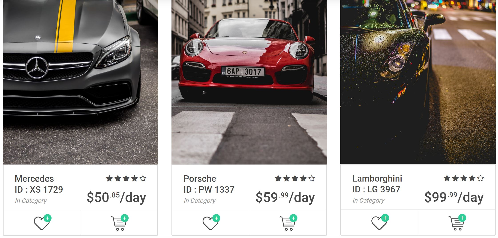
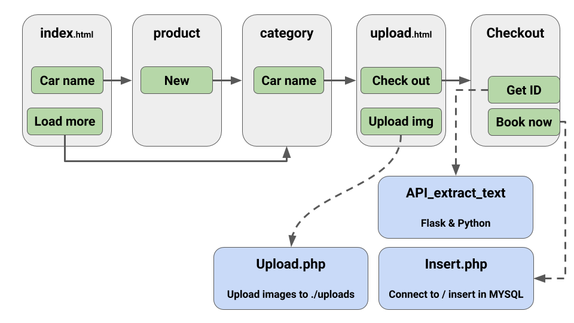

# The Booking Portal

The interface on which a client can book a car. It contains a catalog of available cars, a machine learning engine to extract text (mainly ID number) from ID card as well as the other building blocs responsible for the checkout.

> _HTML, CSS, JS, JQUERY, PHP, APACHE, MYSQL, PYTHON_

Hereafter the relationships between all the webpages and scripts :

