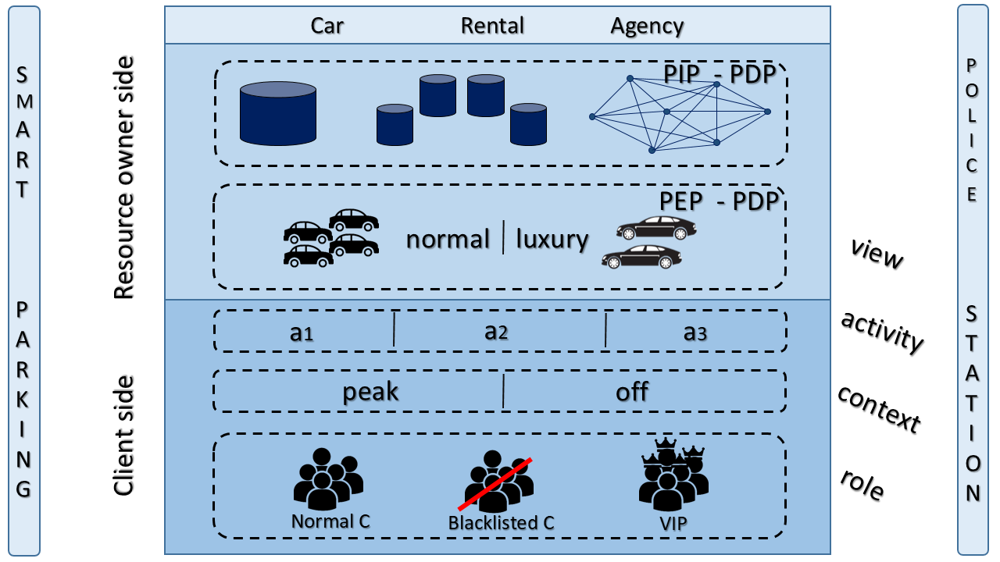

# Car_Access

The IoT is growing by leaps and bounds, thus creating this large, smart and autonomous system requiring less and less human intervention. Smart city (SC) was always the case in point that portrays this vision where devices not only interact but depend on (even control) each other. 

## Car booking portal

## Extract text from image

## Data generation

## Policy Information Point

## Policy Administation Point

## Policy Decision Point

## The overall architecture

As a CRA, our organization is mainly composed of selfdriving cars (decomposed into two views: luxury and normal cars); its customers are generally normal clients, VIP clients or blacklisted ones (which makes respectively three roles: NC, VIP, BC); regarding the activities it is more realistic to categorize them by rental period (a1: 1 day, a2: between 1 and 3 days, and a3: more than 3 days). Finally, the context represents the time of the year during which the request is made: is it a peak season (peak) like summer for example, or off season (off).

## Installation requirements
