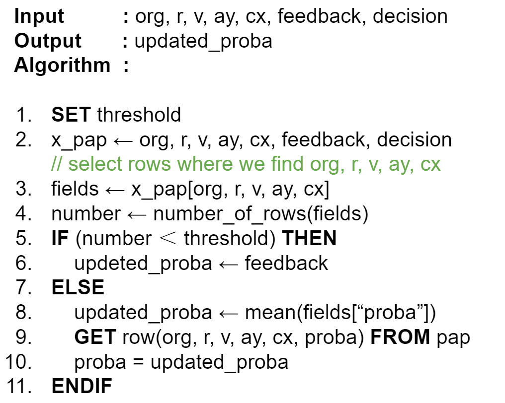
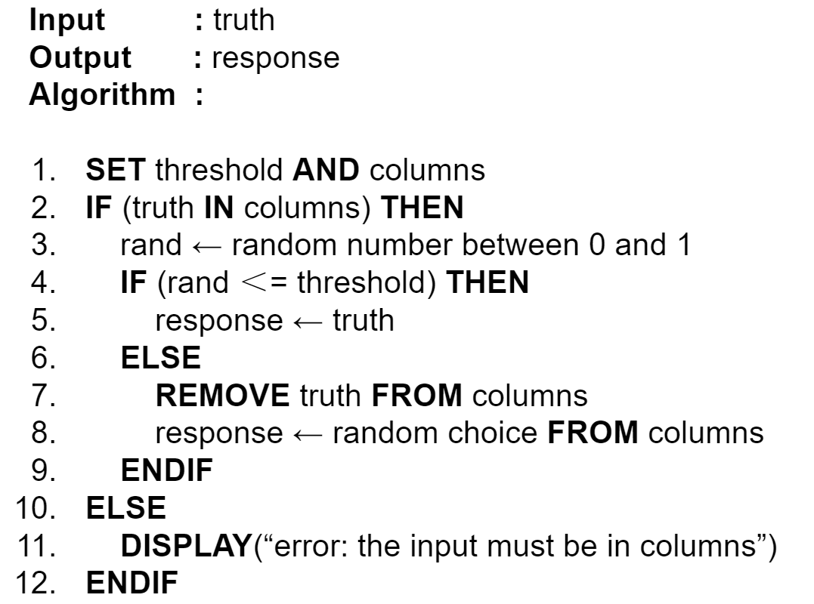

# Learning process

* _Dynamicity_ : The probabilities of how the safe experience is (or will be) are statically stored in the PAP. This feature offers the possibilty to update them based on previous experiences.

Here is the pseudocode which details how this algorithm works :

* _Exploration_ : This property consits of exploring extra new features to encrease the accuracy of future predictions. It is mainly useful when we enable the collaboration aspect, thus learning from other organizations' experiences.

* _Differential Privacy_ : Enable organizations to collaborate while preserving their privacy using a random response implementation of DF.

Differential privacy is a system to collect and share aggregate information about users while withholding information about individual users. In our case, we use randomized response algorithm to ensure this property.

Here is the pseudocode which details how this algorithm works :

> _GOOGLE COLABORATORY -for visualizing results-_
